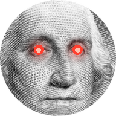
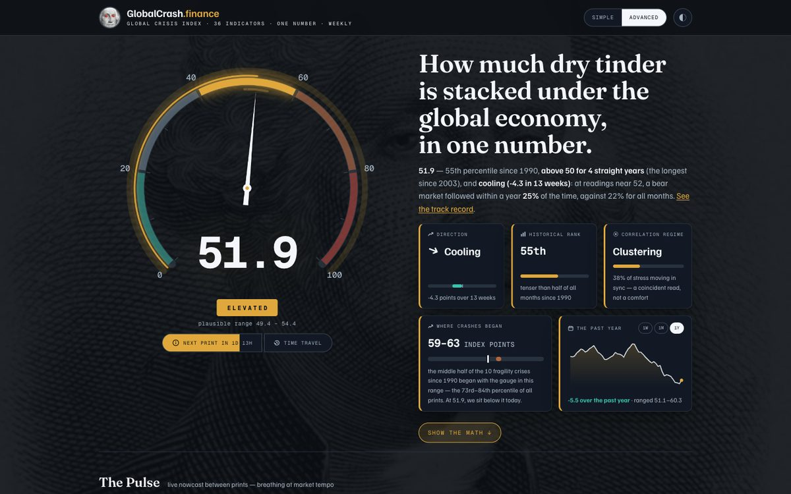
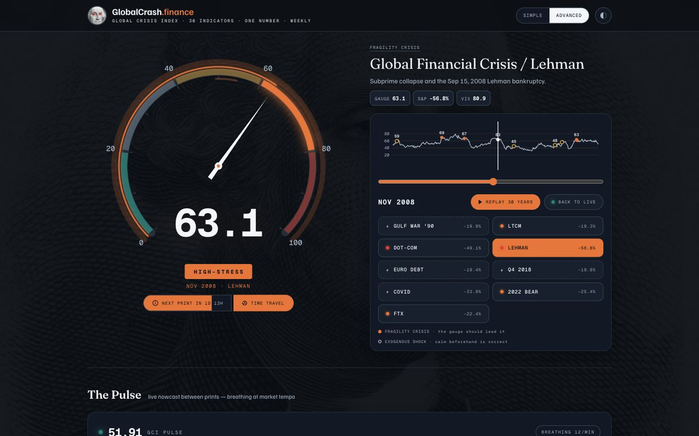
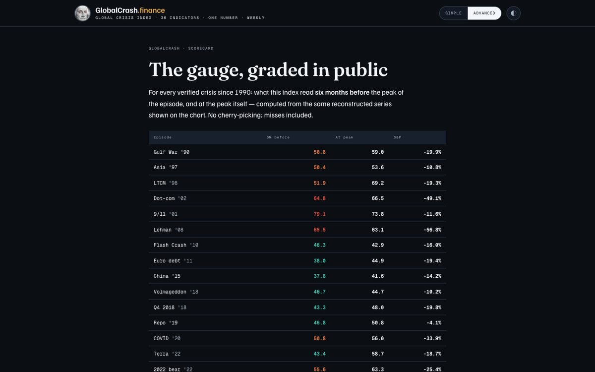
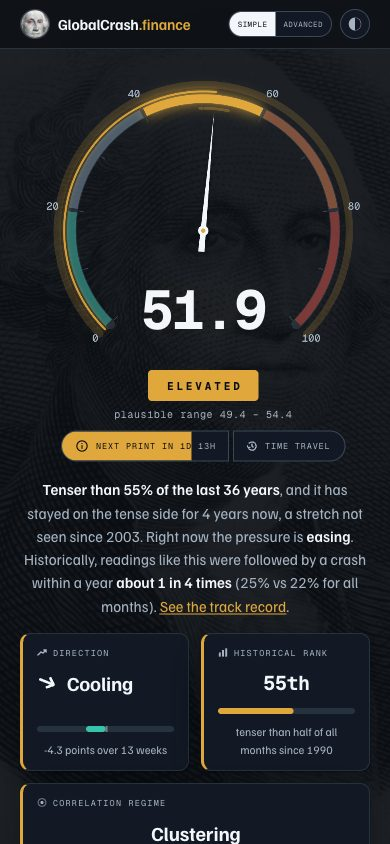

<div align="center">



# GlobalCrash.finance

**The Global Crisis Index** — a live 0–100 reading of how much dry tinder is stacked under the global economy.

Built from 36 free public indicators across seven pillars. Printed every Friday. Graded in public against every crisis since 1990.

*Measures fragility, not timing.*

[](https://globalcrash.finance)
[](https://github.com/JohnDimou/globalcrash.finance/actions/workflows/weekly-print.yml)
[](https://globalcrash.finance/gci.json)


 


<br/>

<a href="https://globalcrash.finance"></a>

</div>

<br/>

## What it is

Every fear gauge on the internet tells you when to panic. None of them show you their track record.

The Global Crisis Index (GCI) is a weekly composite of **systemic financial fragility** — stretched valuations, tightening credit, inverted curves, correlated stress — scored from 0 to 100 and reconstructed monthly back to 1990. Higher means more fuel is stacked; it says nothing about when the match strikes, and it says so out loud.

What makes it different is the **[scorecard](https://globalcrash.finance/scorecard)**: for all 21 verified crises since 1990, the site publishes what the index read six months before and at the peak — hits *and* misses, base rates and false-alarm rates — recomputed at every print. If the gauge is wrong, the gauge tells you first.

One computed sentence sums up each print, in plain words or in full:

> **51.9** — 55th percentile since 1990, **above 50 for 4 straight years** (the longest since 2003), and **cooling (−4.3 in 13 weeks)**: at readings near 52, a bear market followed within a year **25%** of the time, against 22% for all months.

## What's on the page

| | |
|---|---|
| **The gauge** | A spring-damped needle on a five-band dial, a breathing halo whose tempo follows market stress, and a mood-reactive George Washington who smiles, frowns and panics with the reading. |
| **The verdict** | Persistence vs the 50 line, historical precedent, 13-week velocity, and the conditional odds of a bear market at readings like today's — one sentence, every number derived from the data. |
| **The Pulse** | A live nowcast between prints: an oscilloscope of market ticks breathing at the gauge's tempo. |
| **Time Travel** | Scrub 36 years of history. Every crisis is classified as a **fragility crisis** (grown inside the system — the gauge should lead it) or an **exogenous shock** (war, pandemic, policy — calm beforehand is correct). Replay holds on each crash with its sourced cause. |
| **Seven pillars** | Credit & liquidity · Macro cycle · Valuation & froth · Housing · Crypto · Sentiment · Geopolitics — each with live-member counts and what would make it fall. |
| **Case files** | All 21 episodes, opened and studied: drawdown, VIX peak, NBER recession, IMF systemic-crisis classification. |

<div align="center">

<br/><br/>

</div>

## How the number is made

| Pillar | Weight | Anchored in |
|---|---|---|
| Credit & liquidity | 25% | Baa spread · FCI composites (NFCI, OFR FSI + safe assets, St. Louis Fed, US CISS) · nonfinancial leverage · liquidity (net Fed liquidity, funding, M2) · bank credit supply (SLOOS) — five equal sub-buckets |
| Macro cycle | 20% | Yield curve + re-steepening · NY Fed recession probability · Sahm rule · jobless claims · inflation de-anchoring |
| Valuation & froth | 15% | Shiller CAPE · equity risk premium |
| Housing | 10% | Case-Shiller momentum · mortgage spread · building permits |
| Crypto | 10% | BTC MVRV · stablecoin supply · DeFi TVL · perp funding |
| Sentiment | 10% | VIX + term structure · SKEW |
| Geopolitics | 10% | GPR (Caldara–Iacoviello) · EPU · euro-area CISS · OFR EM / advanced stress · oil shocks |

- **Percentile ranks, not z-scores.** Every indicator is its rolling 20-year percentile — fat-tailed financial data breaks Gaussian assumptions; percentiles don't care.
- **Two-sided scoring** for complacency carriers (VIX, credit spreads, leverage, M2): both extremes are fragility.
- **Per-member last-observation-carry-forward** (13 weeks; 17 for quarterly series) *before* pillar math, so a slow series never silently becomes a pillar's only member.
- **Equal weight within a pillar, fixed weights across pillars**, a 4-week EMA on the composite, a 13-week velocity, and a CISS-style correlation layer that reports how much stress is moving in sync.
- **One number per month.** Every crisis event, the dial, the chart and the scorecard read the same monthly value — never a weekly-vs-monthly mismatch.

Full method, weights, known blind spots and the v2 roadmap: **[globalcrash.finance/methodology](https://globalcrash.finance/methodology)**.

## Data

All 36 sources are free and public — no keys, no scraping behind logins:

FRED · OFR Financial Stress Index (+ sub-indexes) · ECB Data Portal (US & euro-area CISS) · CBOE (VIX3M, SKEW) · NY Fed recession probability · Caldara–Iacoviello GPR · Economic Policy Uncertainty · DefiLlama · Coin Metrics · Binance / Bybit / Binance public archive (funding) · multpl (CAPE).

Crisis chronology is source-verified (Yardeni bear-market tables, FRED VIXCLS, NBER, IMF Laeven–Valencia) and classified fragility-vs-shock in `ingest.py`.

The latest print is a free JSON endpoint with CORS: **[globalcrash.finance/gci.json](https://globalcrash.finance/gci.json)**.

## Architecture — zero servers

```
ingest.py            36 sources → 7 pillars → composite, velocity, correlation layer,
                     441-month history, 21 anchored crises        →  data/gci_data.json
build_page.py        injects the data into the single-file page   →  site/src/page.html
site/build_site.py   full SEO head · /methodology · /scorecard · /friday-print
                     social card · icons · sitemap · robots · /gci.json · wallpapers as WebP
                                                                  →  site/public/  (Vercel serves this)
```

**The Friday print** is a GitHub Action (`.github/workflows/weekly-print.yml`): every Friday at 20:05 UTC it recomputes the index, rebuilds the site, commits, and Vercel deploys the commit. No backend, no cron server, no database — the whole thing is a static site that rewrites itself once a week.

Frontend is a single hand-written HTML file: vanilla JS, three `<canvas>` elements (dial, wallpaper, oscilloscope), one SVG chart, ~150 KB of HTML with the wallpapers served as immutable WebP.

<div align="center">

</div>

## Run it locally

```bash
pip install -r requirements.txt
python3 ingest.py                          # ~60 s, pulls the 36 live sources
python3 build_page.py site/src/page.html   # inject the data
python3 site/build_site.py                 # emit site/public/
cd site/public && python3 -m http.server 8000
```

Deploy: import the repo in Vercel — `vercel.json` sets the output directory; nothing else to configure. See `site/README.md`.

## Honesty, built in

- The index **measures fragility, not timing** — the phrase is on every page, and the COVID miss is on the scorecard.
- **No prediction language.** The verdict states historical frequencies; the last 12 months are excluded from every conditional rate because their outcome isn't known yet.
- **No revisions.** A print is never rewritten after the fact.
- **Not investment advice.** It's a public instrument with a public track record. Read it like a barometer, not a broker.

---

<div align="center">
<sub>© 2026 GlobalCrash.finance · Code MIT · Data CC BY 4.0 · Sources cited on the site · Not investment advice</sub>
</div>
